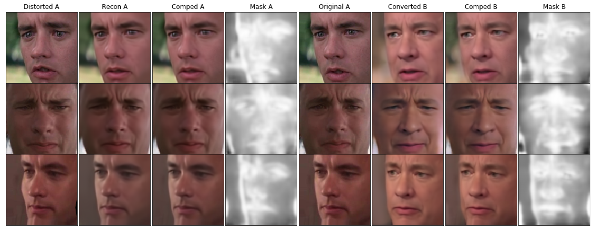
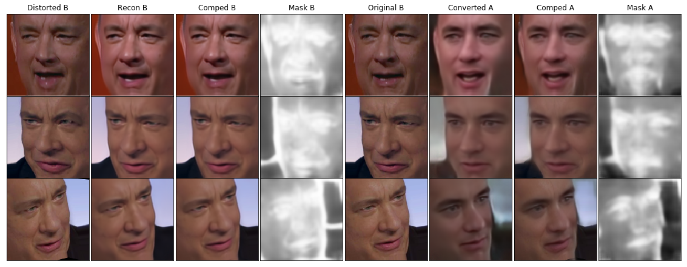

# Faceswap-Autoencoder

This is a Pytorch implementation of a Face Swap Autoencoder, roughly based on  [Shaonlu's tensorflow implementation.](https://github.com/shaoanlu/faceswap-GAN). 

## Notes

- Both the autoencoder and the discriminator are using `spectral normalization`
- Discriminator is being used only as a `learned preceptual loss`, not a direct adversarial loss
- Conv2d has been customized to properly use spectral normalization before a pixel-shuffle
- Downsampling operations have been remove from VGG-Face to provide more detail in perceptual loss
- There are still a couple things I'm testing to improve this, so be aware this is `STILL IN PROGRESS`

## Example Output
### Tom Hanks(Young to Old)

### Tom Hanks(Old to Young)

## Code Usage
Usage instructions found here: [user manual page](USAGE.md).

