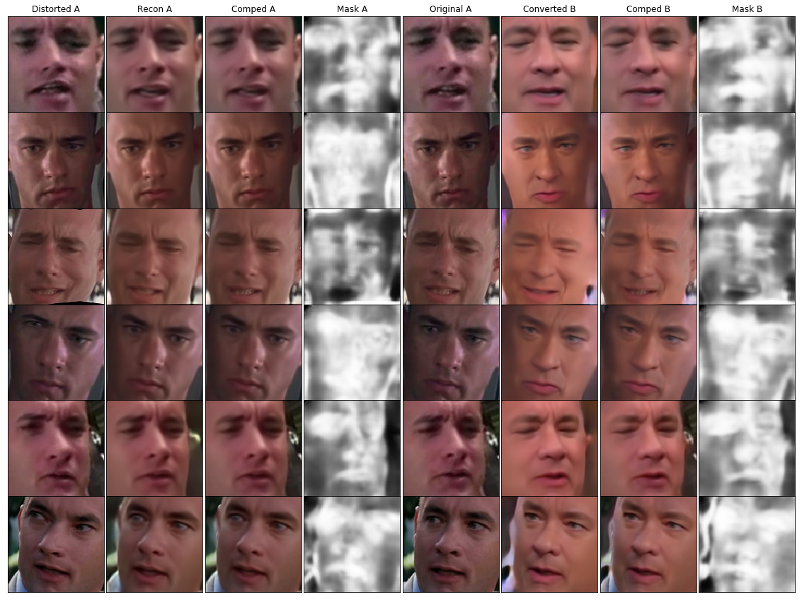
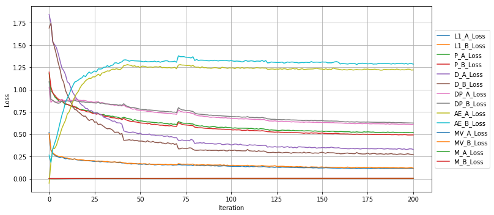

## Getting Started
- Check your python version, this is built on `python 3.6`
- Install `pytorch 0.4.1` and dependencies from https://pytorch.org/
- Install packages `tqdm`, `cv2`, `matplotlib`, `skimage`

- Clone this repo:
```bash
git clone https://github.com/NeuralVFX/faceswap-autoencoder.git
cd faceswap-autoencoder
```

- Download the VGG Face Weights
```bash
bash models/get_weights.sh
```

- Populate face images into the `data/faceA` and `data/faceB` folders

## Train The Model
```bash
python train.py --train_epoch 200 --save_root face_swap
```

## Continue Training Existing Saved State
```bash
python train.py --train_epoch 200 --save_root face_swap --load_state output/face_swap_10.json
```

## Command Line Arguments
```              
--dataset_a, default='faceA', type=str                         # Dataset folder name for FaceA
--dataset_b, default='faceB', type=str                         # Dataset folder name for FaceB
--enc_att, default=True, type=bool                             # Whether to use attention in Encoder 
--dec_att, default=True, type=bool                             # Whether to use attention in Decoder
--disc_att, default=False, type=bool                           # Whether to use attention in Discriminator
--batch_size, default=10, type=int                             # Training batch size
--workers, default=16, type=int                                # How many threads to help with dataloading
--res, default=128, type=int                                   # Image resolution, for dataloading and autoencoder (must be a power of 2: 128, 256, 512, 1024)
--res_layers_p, default=[2,6,9,14,17,20,23,26], type=int       # Layers of Resnet to use for perceptual loss
--res_layers_p_weight, default=[1,1,1,1,1,1,1,1], type=float   # Weight multiplier for each Resnet layer 
--recon_weight, default=3., type=float                         # Multiplier for L1 loss
--edge_weight, default=.1, type=float                          # Multiplier for Edge loss
--train_epoch, default=200, type=int                           # Number of epochs to train for
--beta1, default=.5, type=float                                # Beta1 value used by optimizer
--beta2, default=.999, type=float                              # Beta2 value used by optimizer
--lr, default=2e-4, type=float                                 # Learning rate
--lr_drop_start, default=0, type=int                           # Epoch on which the learning rate will begin to drop
--lr_drop_every, default=40, type=int                          # How many epochs between every learning rate drop, learning rate will cut in half each time
--save_every, default=10, type=int                             # How many epochs between each model save
--save_img_every, default=1, type=int                          # How many epochs between saving image
--save_root, default='face_swap_test', type=str                # Prefix for files created by the model under the /output directory
--load_state, type=str                                         # Optional: filename of state to load and resume training from
```

## Output Folder Structure

- `weights`, `test images` and `loss graph`, are all output to this directory: `output/<save_root>_*.*`

- Test Image A Example: `output/faceswap_A_200.jpg`

- Test Image B Example: `output/faceswap_B_200.jpg`


- Loss Graph Example (output every time weights are saved): `output/faceswap_loss_160.jpg`


